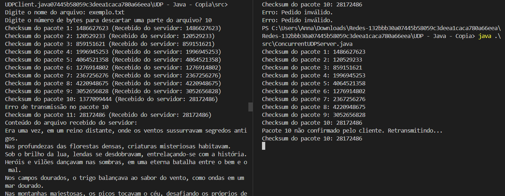

# Protocolo UDP

Neste trabalho, é explorado a implementação de uma aplicação que utiliza o Protocolo de Datagrama de Usuário (UDP) através da programação com sockets.  

## Modo de execução do código:

1. Primeiro, execute o servidor e depois o cliente. No terminal, execute:
    ```bash
    java .\src\ConcurrentUDPServer.java
    ```
2. Em outra aba, navegue até a pasta `src` e execute:
    ```bash
    java UDPClient.java
    ```

## Arquivos usados para teste:

Os arquivos usados para teste foram `exemplo.txt` e `anotherFile.txt`.

Cabe ressaltar que o arquivo será impresso na tela do cliente, e caso seja desejado o descartes de bytes o mesmo deve ser informado. Caso contrário, é necessário digitar zero. Ao selecionar o descarte de bytes, os mesmos serão removidos do final do arquivo (último pacote).

## Resultado

Na sequência é apresentado uma execução do código.

<p align="center">
  
  <br>
  <em>Diagrama de cores referente a posição do JoyStick</em>
</p>

